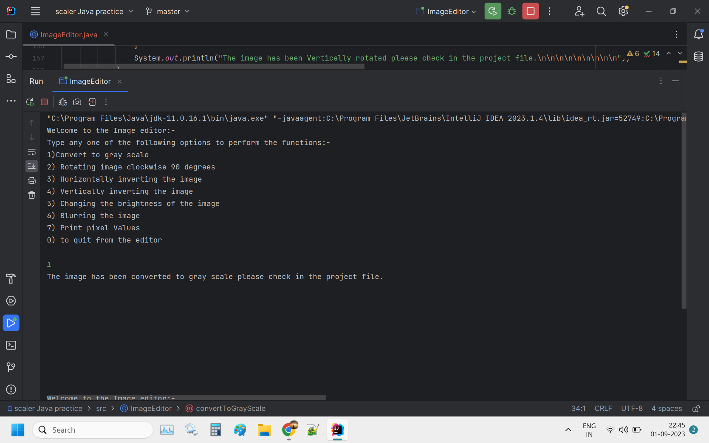

# EditMagic


Java Image EditMagic is a simple image editing tool that allows you to perform various operations on images, such as converting to grayscale, rotating, inverting, adjusting brightness, and more.

The initial image is :- 


## Features

- **Convert to Grayscale:** Transform colored images into grayscale.
  
  

- **Rotate:** Rotate images 90 degrees clockwise.

- **Horizontal Invert:** Flip images horizontally.

- **Vertical Invert:** Flip images vertically.

- **Adjust Brightness:** Increase or decrease image brightness.

## Getting Started

Follow these steps to get started with the Java Image Editor:

### Prerequisites

- Java Installed on the device
- Any Java IDE.
- An Image.

### Usage
- Open the project in your favorite Java IDE (e.g., Eclipse, IntelliJ IDEA).

- Run the ImageEditor.java file.
- You will be presented with a menu of options:
- Convert to Grayscale: Converts the image to grayscale and saves it.
- Rotate: Rotates the image 90 degrees clockwise and saves it.
- Horizontal Invert: Flips the image horizontally and saves it.
- Vertical Invert: Flips the image vertically and saves it.
- Adjust Brightness: Adjusts the image brightness and saves it.
- Exit: Quits the image editor.
- Follow the on-screen instructions to perform the desired operation on your image.

### Examples
```
// Load an image
BufferedImage inputImage = ImageIO.read(new File("input.jpg"));

// Convert the image to grayscale
BufferedImage grayScaleImage = ImageEditor.convertToGrayScale(inputImage);
ImageIO.write(grayScaleImage, "jpg", new File("grayscale.jpg"));

// Rotate the image 90 degrees clockwise
BufferedImage rotatedImage = ImageEditor.rotateClockwise(inputImage);
ImageIO.write(rotatedImage, "jpg", new File("rotated.jpg"));

// Adjust the brightness of the image by 20%
BufferedImage brightenedImage = ImageEditor.changeBrightness(inputImage, 20);
ImageIO.write(brightenedImage, "jpg", new File("brightened.jpg"))```


Enjoy image editing with Java!


